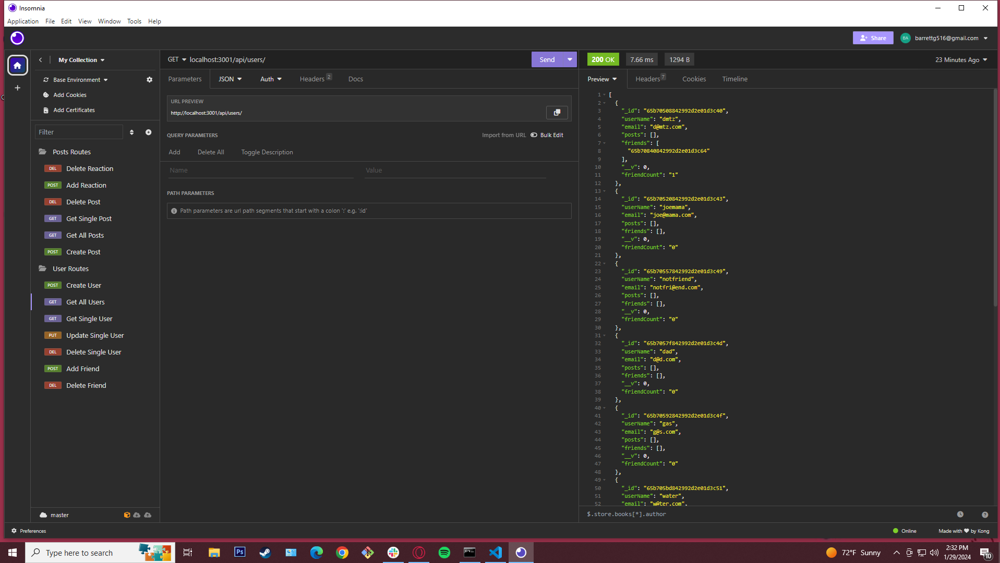

# Social Media App

## Description
This is a simple backend for a social media app that stores users, friends, posts, and reactions to posts.

## Motivation
I wanted to practice working with models in a database and having them relate together. Also, the more practice with express and databases, the better for getting into the job field.

## Table of Contents
- [Installation](#installation)
- [Usage](#usage)
- [Credits](#credits)
- [License](#licenses)
- [Questions](#questions)

## Installation
Fork/clone the repo, open in your IDE, and run `npm i`. Just like that you're ready.

## Usage
Run `node server.js`. Then, open up Insomnia and create a new project. You can look through the routes/api files to see what routes can be used, and look at the models to see what they accept. There are several GET, POST, PUT, and DELETE routes to mess around with! 
BUGS: In my video demo for some reason the 'UPDATE User' request didn't work, though it was before. Both the 'UPDATE User' and 'DELETE User' functions would show a long request time in insomnia and eventually say it "Timed Out", but would still do what they were supposed to. 

Video Link:  https://drive.google.com/file/d/1ip9uualinSFVNg-l8SIRG_-eXPOPL7Vj/view?usp=sharing

## Credits
Express Docs - https://devdocs.io/express/   
Mongoose Docs - https://mongoosejs.com/docs/

## Licenses
This project is covered by the MIT license.

## Questions 
If you have any questions or would like to reach out for any reason, please feel free!
My Email: barrettg516@gmail.com

Github: g-barrett (https://github.com/g-barrett)
